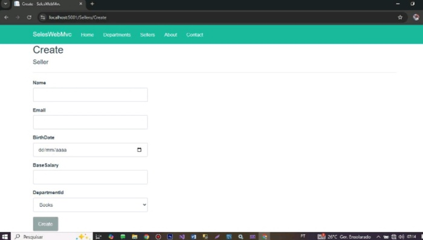
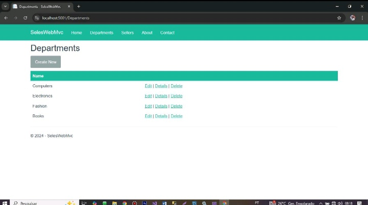

# Sales Web MVC - ASP.NET Core

Aplicação web desenvolvida com ASP.NET Core MVC para gestão de vendedores, departamentos e vendas.  
O sistema permite realizar operações CRUD completas, com interface simples e integração com base de dados.

---

## Demonstração

### Cadastrar vendedor

### Departamentos

---

## Tecnologias utilizadas

- ASP.NET Core MVC
- C#
- Entity Framework Core
- SQL Server
- Razor Pages
- Bootstrap

---

## Funcionalidades

- ✅ Cadastro de vendedores
- ✅ Edição e remoção de dados
- ✅ Associação de vendedores a departamentos
- ✅ Listagem de informações com interface amigável
- ✅ Integração com base de dados relacional
- ✅ Tratamento de erros e validações

---

## Conceitos aplicados

- Arquitetura MVC (Model-View-Controller)
- Separação de responsabilidades
- Injeção de dependência (Dependency Injection)
- Acesso a dados com Entity Framework Core
- Boas práticas de organização de código

---

## Autor

**Heldemilde João**
